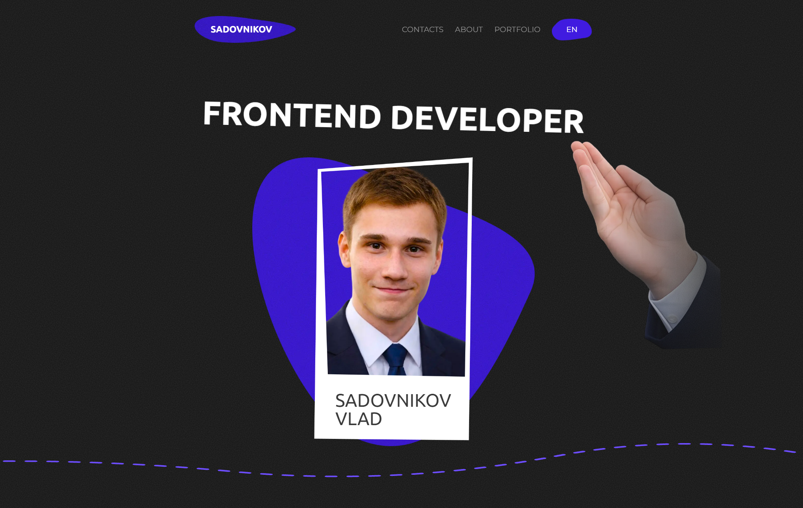
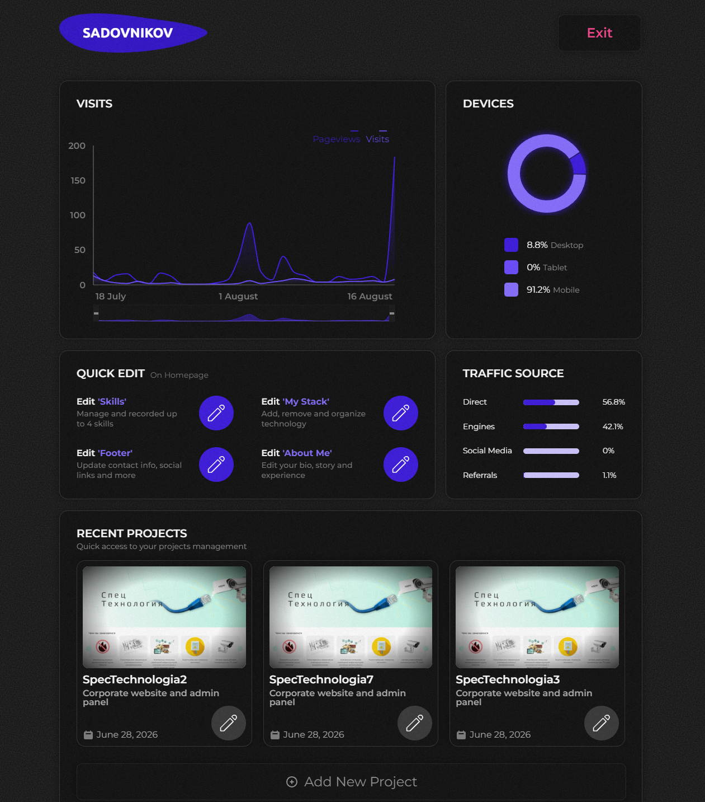
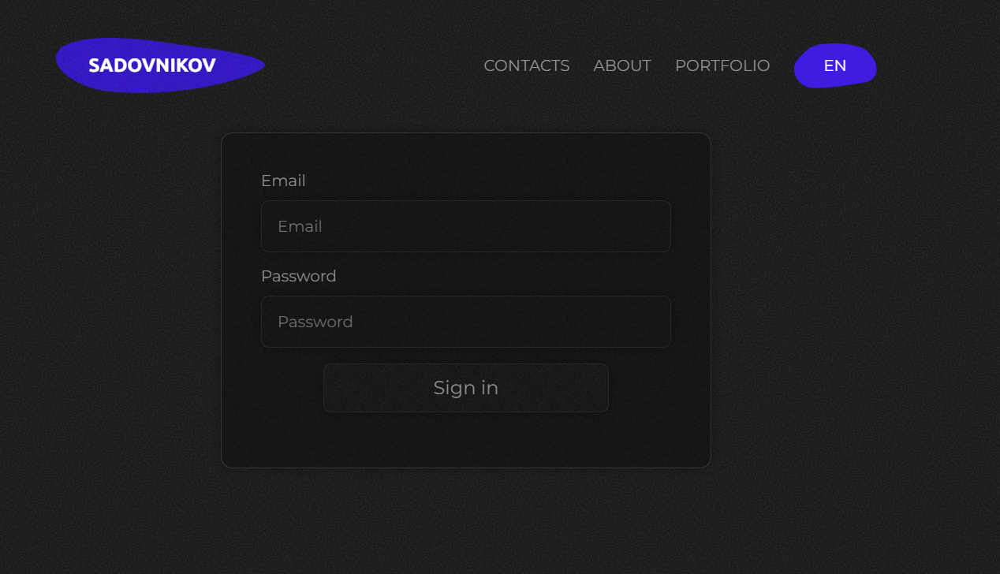
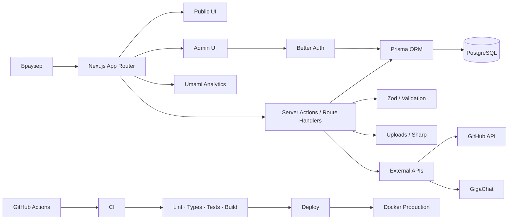
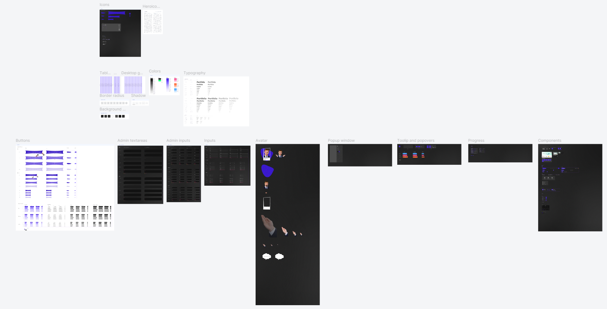

# SADOVNIKOV

### Персональное портфолио, которое со временем превратилось в полноценный full-stack проект

**Next.js · React · TypeScript · PostgreSQL · Prisma · Docker · GitHub Actions**

[](https://vlassadassa.ru)
[](https://github.com/VlassaDassa/Sadovnikov/actions/workflows/ci.yml)
[](https://github.com/VlassaDassa/Sadovnikov/actions)
[](https://github.com/VlassaDassa/Sadovnikov/commits/main)

**[Сайт](https://vlassadassa.ru) · [Figma](https://www.figma.com/design/qYYGvs1TraAVy6K7T8sjwO/Portfolio?node-id=0-1&t=b81OmKJ2Bm4Dhv0R-1) · [Архитектурные заметки](./docs/ARCHITECTURE_NOTES.md)**

---

## О проекте

**Sadovnikov** начинался как обычный персональный сайт-портфолио.

Главной задачей было сделать собственный сайт, на котором я смогу показать опыт, стек и проекты потенциальному работодателю.

Но по мере развития проекта его архитектура постепенно становилась сложнее.

В какой-то момент статических данных и обычного React-приложения стало недостаточно. Проект был мигрирован на **Next.js**, появилась полноценная серверная часть, PostgreSQL, Prisma, авторизация, административная панель, загрузка и обработка изображений, аналитика, интеграции с внешними сервисами, тестирование и CI/CD.

В результате Sadovnikov стал не только портфолио, но и большим учебным проектом, на котором я изучал архитектуру современных full-stack приложений.

При этом дизайн сайта также разрабатывался мной самостоятельно. Для проекта существует отдельная дизайн-система в Figma, которая несколько раз перерабатывалась вместе с изменением архитектуры приложения.

---

## Демо

**Production:**  
https://vlassadassa.ru

---

## Основные возможности

### Публичная часть

- главная страница портфолио;
- информация обо мне и опыте работы;
- технологический стек;
- список проектов;
- отдельные страницы проектов;
- история развития проектов;
- RU / EN локализация;
- адаптивная версия;
- контактная форма;
- SEO metadata;
- sitemap и robots;
- аналитика посещений.

<p align="center">
  
</p>

### Административная панель

Через административную часть можно управлять контентом сайта без непосредственного изменения исходного кода.

В том числе:

- создавать и редактировать проекты;
- изменять описание проектов;
- редактировать стек;
- управлять изображениями;
- изменять ключевые особенности проекта;
- редактировать метрики;
- управлять историей развития проекта;
- редактировать информацию обо мне;
- изменять опыт работы;
- работать с другими динамическими данными сайта.

<p align="center">
  
</p>

---
## Авторизация

Административная часть защищена авторизацией.

Для authentication используется **Better Auth** с хранением пользователей и сессий в PostgreSQL.

Проверка доступа выполняется не только на уровне интерфейса.

Серверные действия, административные страницы и операции с файлами также требуют авторизованного администратора.

<p align="center">
  
</p>

---

## Архитектура



---

# Технологический стек

## Frontend

- **Next.js**
- **React**
- **TypeScript**
- **SCSS**
- **Redux Toolkit**
- **next-intl**
- **dnd-kit**

## Backend

- **Next.js Server Actions**
- **Route Handlers**
- **Prisma ORM**
- **PostgreSQL**
- **Better Auth**
- **Zod**
- **Nodemailer**
- **Sharp**

## Инфраструктура

- **Docker**
- **Docker Compose**
- **GitHub Actions**
- **pnpm**
- **Caddy / reverse proxy на production**

## Тестирование

- **Vitest**
- **Testing Library**
- **Playwright**
- **axe-core**

## Security

- **CodeQL**
- **pnpm audit**
- **Dependabot**

---

# Работа с данными

Большая часть контента сайта хранится в PostgreSQL.

Проекты представлены не одной большой JSON-структурой, а набором связанных сущностей.

Например:

```text
Project
 ├── Images
 ├── Stack
 ├── Key Features
 ├── Description Blocks
 ├── Metrics
 └── Commits / Evolution
```

Для доступа к базе используется Prisma.

Это позволяет работать с типизированными данными, relations, migrations и transactions.

---

# Загрузка изображений

В административной панели реализована собственная система загрузки изображений.

Она включает:

- проверку размера файла;
- проверку путей;
- разделение файлов по проектам и категориям;
- обработку изображений;
- генерацию безопасного публичного пути;
- удаление старых файлов;
- защиту от path traversal;
- обработку через Sharp;
- sanitization SVG.

Структура upload-файлов отделена от статических ресурсов приложения.

---

# Локализация

Сайт поддерживает:

```text
English
Russian
```

Для маршрутизации и интерфейса используется `next-intl`.

Часть динамических данных в PostgreSQL также содержит локализованные поля.

Например:

```text
title
titleRu

text
textRu

description
descriptionRu
```

Такой подход выбран специально под текущую задачу проекта — поддержку двух языков.

---

# Project Evolution

У проектов есть отдельная история развития.

Она позволяет показывать этапы разработки проекта:

```text
Первый прототип
↓
Изменение архитектуры
↓
Миграция
↓
Добавление новой функциональности
↓
Рефакторинг
↓
Production
```

Также в проекте появилась интеграция с **GitHub API** и **GigaChat**.

Идея заключается в том, чтобы использовать реальные commits проекта как источник для формирования milestones.

При этом генерация не является полностью свободной: milestone должен быть связан с реальными commit SHA.

---

# Аналитика

Для аналитики используется **Umami**.

Данные могут отображаться в административной части сайта.

Аналитика является дополнительной системой и не должна влиять на доступность основной функциональности приложения.

Если аналитический сервис недоступен, публичный сайт продолжает работать.

---

# Тестирование

Когда проект стал достаточно большим, ручной проверки стало недостаточно.

Поэтому тестирование было разделено на несколько уровней.

## Unit / Component

Проверяются:

- utility-функции;
- reducers;
- hooks;
- небольшие React-компоненты;
- пользовательские состояния компонентов.

```bash
pnpm test:unit
```

---

## Server tests

Проверяются:

- Server Actions;
- авторизация;
- routes;
- загрузка файлов;
- отправка почты;
- contract logic;
- validation;
- error handling.

```bash
pnpm test:server
```

---

## Integration tests

Integration-тесты работают с **реальной PostgreSQL**.

Они используются там, где mocks могут скрыть реальные ошибки:

- mappings;
- relations;
- transactions;
- создание сущностей;
- обновление сущностей;
- удаление связанных данных.

```bash
pnpm test:db:up
pnpm test:db:migrate
pnpm test:db:seed
pnpm test:integration
pnpm test:db:down
```

---

## E2E

Playwright запускает production build приложения и проверяет реальные пользовательские сценарии.

В том числе:

- публичные страницы;
- авторизацию;
- redirect административных страниц;
- контактную форму;
- SEO;
- accessibility;
- security headers;
- mobile overflow;
- поведение неизвестных страниц.

```bash
pnpm build
pnpm test:e2e
```

---

## Accessibility

Автоматические accessibility-проверки выполняются через `axe`.

Это не заменяет полноценное ручное accessibility-тестирование, но позволяет автоматически ловить часть типовых проблем.

---

# CI/CD

В проекте настроен полноценный pipeline через **GitHub Actions**.

## Pull Request

После создания или обновления Pull Request автоматически запускаются проверки.

```text
Pull Request
      │
      ▼
PostgreSQL service
      │
      ├── install dependencies
      ├── Prisma generate
      ├── Prisma validate
      ├── migrations
      ├── seed
      ├── lint
      ├── typecheck
      ├── unit / component tests
      ├── server tests
      ├── integration tests
      ├── production build
      └── Chromium E2E
```

Если обязательная проверка падает, Pull Request нельзя нормально слить в `main`.

---

## Production deployment

После merge код попадает в `main`.

После этого CI запускается ещё раз уже для фактического состояния основной ветки.

```text
main
  │
  ▼
test
  │
  ├── FAILED
  │      │
  │      └── Deploy skipped
  │
  └── SUCCESS
         │
         ▼
       Deploy
         │
         ▼
     Production
```

Таким образом production-деплой выполняется только после успешного прохождения автоматических проверок.

---

# Security

Помимо основного CI существует отдельный security workflow.

Он включает:

### CodeQL

Статический анализ кода на потенциальные уязвимости.

### Dependency Audit

```bash
pnpm audit --audit-level high
```

Проверяет дерево зависимостей на известные security advisories.

### Dependabot

Dependabot автоматически создаёт Pull Request при появлении новых версий зависимостей.

Каждый такой Pull Request также проходит обычный CI.

Поэтому обновление зависимости не попадает в проект автоматически только потому, что существует новая версия.

---

# Docker

Production-версия приложения запускается в Docker.

Используются отдельные контейнеры приложения и PostgreSQL.

У базы настроен healthcheck.

Приложение запускается после того, как PostgreSQL становится доступным.

Упрощённо:

```text
Docker Compose
      │
      ├── PostgreSQL
      │      └── persistent volume
      │
      └── Next.js application
               │
               └── production build
```

Приложение внутри container запускается не от root-пользователя.

---

# Структура проекта

```text
Sadovnikov
│
├── .github/
│   └── workflows/
│       ├── ci.yml
│       └── security.yml
│
├── prisma/
│   ├── migrations/
│   ├── schema.prisma
│   └── seed
│
├── public/
│
├── src/
│   │
│   ├── app/
│   │
│   ├── components/
│   │   ├── admin/
│   │   ├── public/
│   │   └── shared/
│   │
│   ├── hooks/
│   ├── i18n/
│   ├── interfaces/
│   ├── lib/
│   ├── store/
│   └── styles/
│
├── tests/
│   ├── component/
│   ├── e2e/
│   ├── integration/
│   └── server/
│
├── Dockerfile
├── compose.prod.yaml
├── compose.test.yaml
└── README.MD
```

---

# Локальный запуск

## Требования

Перед запуском понадобятся:

- Node.js;
- pnpm;
- PostgreSQL;
- Docker / Docker Compose для integration-тестов.

---

## Клонирование

```bash
git clone https://github.com/VlassaDassa/Sadovnikov.git

cd Sadovnikov
```

---

## Установка зависимостей

```bash
pnpm install
```

---

## Environment variables

Создайте локальный `.env`.

Production credentials нельзя хранить в Git.

Для тестового окружения используется отдельная конфигурация.

---

## Prisma

```bash
pnpm exec prisma generate
pnpm exec prisma migrate deploy
```

---

## Development

```bash
pnpm dev
```

После запуска:

```text
http://localhost:3000
```

---

# Полезные команды

```bash
# Development
pnpm dev

# Production build
pnpm build

# Lint
pnpm lint

# TypeScript
pnpm typecheck

# Unit / Component
pnpm test:unit

# Server
pnpm test:server

# Integration
pnpm test:integration

# E2E
pnpm test:e2e

# Test database
pnpm test:db:up
pnpm test:db:migrate
pnpm test:db:seed
pnpm test:db:down
```

---

# Design System

Визуальная система проекта разрабатывалась отдельно в Figma.

В ней описывались:

- цвета;
- типографика;
- кнопки;
- состояния компонентов;
- декоративные элементы;
- отступы;
- адаптивные варианты;
- общие UI-паттерны.

В процессе разработки дизайн-система несколько раз менялась.

Особенно сильно её пришлось пересмотреть после миграции проекта на Next.js, когда некоторые старые решения начали конфликтовать с новой архитектурой компонентов.

**Figma:**

https://www.figma.com/design/qYYGvs1TraAVy6K7T8sjwO/Portfolio?node-id=118-309&t=TDitP6gfY2icaRyS-1


<p align="center">
  
</p>

---

# История проекта

Sadovnikov несколько раз серьёзно менялся.

Упрощённо развитие выглядело примерно так:

```text
идея портфолио
      ↓
React frontend
      ↓
собственная дизайн-система
      ↓
переработка UI
      ↓
миграция на Next.js
      ↓
Server / Client architecture
      ↓
PostgreSQL + Prisma
      ↓
Admin panel
      ↓
Authentication
      ↓
Uploads
      ↓
Analytics
      ↓
GitHub / AI integration
      ↓
Testing
      ↓
Security
      ↓
CI/CD
      ↓
Production
```

В репозитории сохранилась история этих изменений.

Я не считаю все архитектурные решения проекта идеальными.

Наоборот, часть ценности этого проекта для меня заключается в том, что многие решения я сначала реализовал одним способом, потом столкнулся с их ограничениями и переделал.

Более подробные заметки по истории архитектуры находятся здесь:

**[ARCHITECTURE_NOTES_RU.md](./docs/ARCHITECTURE_NOTES_RU.md)**

Там описаны не только финальные решения, но и причины появления некоторых компонентов, ошибки, миграции и вещи, которые сейчас я сделал бы иначе.

---

# Что я получил от этого проекта

Этот проект дал мне намного больше практики, чем я изначально ожидал.

На нём я столкнулся не только с разработкой интерфейса, но и с:

- проектированием UI-системы;
- архитектурой компонентов;
- миграцией приложения;
- Server / Client Components;
- базой данных;
- relations;
- migrations;
- transactions;
- authentication;
- server validation;
- upload pipeline;
- security;
- external API;
- Docker;
- production deployment;
- автоматизированным тестированием;
- CI/CD.

Главный вывод после всей разработки:

**добавить технологию в проект гораздо проще, чем понять, действительно ли она проекту нужна.**

Некоторые инструменты, которые я пробовал, в итоге были удалены.

Например:

- visual regression testing;
- Lighthouse CI;
- k6 load testing.

Они были полезны как эксперимент, но стоимость их поддержки для этого проекта оказалась выше реальной пользы.

---

# Автор

### Vlad Sadovnikov

**Frontend Developer**

[Сайт](https://vlassadassa.ru)  
[GitHub](https://github.com/VlassaDassa)  
[Telegram](https://t.me/VlassaDassa)

---

> Этот проект начинался как обычное портфолио.
>
> В итоге он стал местом, где я несколько раз успел поменять архитектуру, ошибиться, переделать решение и понять, почему второй вариант лучше первого.
>
> Поэтому для меня Sadovnikov — это не только финальный сайт, но и история того, как я учился строить приложение целиком.